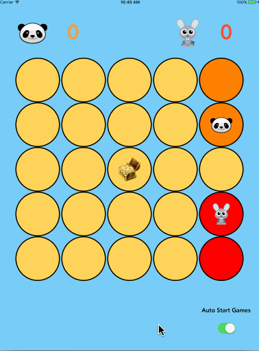

# 3drGridGame

## Video walkthrough

Here's a walkthrough of implemented user stories:

GIF created with [LiceCap](http://www.cockos.com/licecap/).

* [x] Create a view with a 5x5 grid of cells (see example picture below).
* [x] Place the prize on a random cell in the grid (but not in any of the corners).
* [x] Spawn two players in different corners of the grid. The players will initially occupy one cell.
* [x] When the game starts, each player should start searching the grid by moving to adjacent cells (not
diagonally). The players should move at a rate that allows game progress to be observed visually.
* [x] As each player moves the grid should reflect where the player has been. Players cannot cross the trail
left by the other player. However, players can backtrack on their own trail or decline to move if the
player is unable to move to any other adjacent cell.
* [x] If a player backtracks over its own trail, the cell it previously occupied should be cleared.
* [x] When one of the players finds the prize, update the score and start a new game.
* [x] Option to disable auto start

TODO

* [ ] Improve the path logic by backtracking only when not able to proceed furthur. Currently it can backtrack to its own path even when there is an option to proceed furthur
* [ ] Backtrack should only move to the previous position. Currently it can backtrack to adjacent item if it is part of the player path.
* [ ] Add animations to when player wins and highlight score

